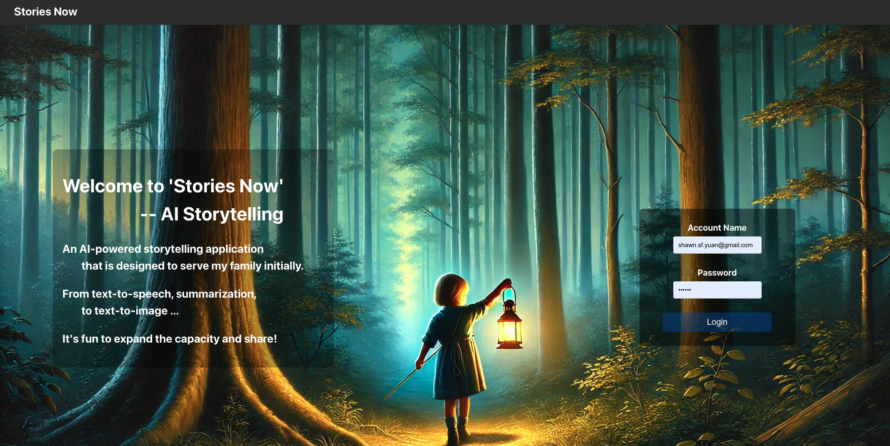

# Stories Now - AI Storytelling Application

Stories Now is an AI-powered storytelling application that converts text to speech using advanced AI models. Initially designed for family use, it's expanding to include more features like summarization and text-to-image capabilities.

## Features

- Text-to-Speech conversion using AI
- User authentication
- Real-time status tracking for audio generation
- Secure file storage and retrieval
- Modern, responsive UI

## Architecture

The application uses a microservices architecture with the following components:

- Frontend: React.js application
- Backend API: Flask server
- Message Queue: RabbitMQ
- Database: MongoDB with GridFS
- TTS Service: Custom TTS implementation using Kokoro

## Screenshots

### Login Page

### Text-to-Speech Interface
  

## Technical Stack

### Frontend
- React.js
- React Router for navigation
- Modern CSS with flexbox/grid
- Responsive design

### Backend
- Python Flask
- PyMongo for MongoDB integration
- Pika for RabbitMQ communication
- JWT for authentication
- GridFS for audio file storage

### Infrastructure
- Kubernetes for container orchestration
- RabbitMQ for message queuing
- MongoDB Atlas for database

## Setup Instructions

### Prerequisites
- Docker and Kubernetes installed
- Node.js and npm
- Python 3.8+
- MongoDB Atlas account
- RabbitMQ