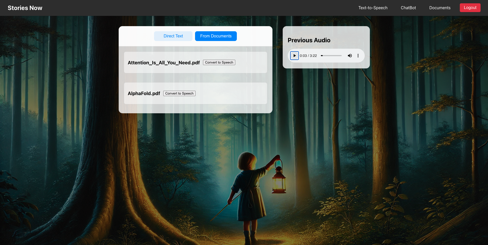

# Stories Now - AI Storytelling Application

Stories Now is an AI-powered storytelling application that converts text to speech using advanced AI models. Initially designed for family-use text-to-speech, it's expanding to include more features like summarization and text-to-image capabilities.

## Architecture

The application uses a microservices architecture with the following components:

- Frontend: React.js application
- Backend API: Flask server
- Text-to-Speech (TTS) Service: Custom TTS implementation using Kokoro
- Chat Service: Vector similarity search and RAG
- PDF Processor Service: Async document processing (chunking, embedding, and vector storage)
- Gateway Service: Authentication, request routing
- Message Queue: RabbitMQ
- Database: MongoDB with GridFS and vector store

### AI Integration

- LangChain for AI interactions
- SentenceTransformer for text embeddings
- spaCy (en_core_web_lg) for text processing
- Kokoro and GPT-SoVITs for Text-to-Speech
- OpenAI GPT-3.5 Turbo for chat responses

## Screenshots

### Text-to-Speech Interface

  

### RAG Page

  

### Login Page

## Technical Stack

### Backend
- Python Flask
- PyMongo for MongoDB integration
- Pika for RabbitMQ communication
- JWT for authentication
- GridFS for audio file storage

### Frontend
- React.js, CSS, Responsive design

### Infrastructure
- Kubernetes for container orchestration
- RabbitMQ for message queuing
- MongoDB Atlas for database and vector store

## Setup Instructions

### Prerequisites
- Docker and Kubernetes installed
- Node.js and npm
- Python 3.8+
- MongoDB Atlas account
- RabbitMQ